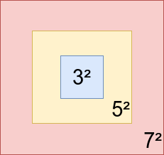

# adventofcode2017

Solutions for Advent of Code 2017 edition: http://adventofcode.com/2017

## Day 01

- Part 1:

We just need to loop through each digit and check if the next one equals the current one. If this is true, we increment the sum. There's an edge case: the last position. In this case, we make the position point to the beginning:

```kotlin
var nextIndex = i + 1
if (nextIndex >= number.length) {
    nextIndex -= number.length
}
```
```
Time - O(n)
Space - O(1)
```

- Part 2:

Same thing, but instead of checking the next digit, we check the one n/2 steps ahead.

```kotlin
var nextIndex = i + number.length/2
```

## Day 02

- Part 1

Go through each line and find its minimum and maximum values. Then increment the sum with (maximum-minimum).

```
Time - O(nm) (n - lines / m - columns)
Space - O(1)
```

- Part 2

Go through each element in the line and check the ones after it. If they evenly divide, then increment the sum.

```kotlin
for (j in 0 until array[i].size - 1) {
    val num = array[i][j]
    for (k in j + 1 until array[i].size) {
        val num2 = array[i][k]
        val max = Math.max(num2, num)
        val min = Math.min(num2, num)
        if (max % min == 0) {
            sum += max / min
            break
        }
    }
}
```

```
Time - O(nm²) 
Space - O(1)
```

## Day 03

- Part 1

By observation, we see that the matrix grows in size by powers of odd numbers: 3²,7²,9²,11²



First layer has numbers from 2 to 9

Second layer has numbers from 10 to 25

Third layer has numbers from 26 to 49

Given a number n, we can determine which layer it belongs to, by calculating its square root, rounding it, and checking if it's an even number. If it's not, then we increment it so it becomes an odd number.

<b>Example: n = 8

sqrt(8) ~ 2,828 -> rounding it becomes 3, so it's in the first layer.

<b>Example: n = 33

sqrt(33) ~ 5,74 -> rounding it becomes 6. Since 6 is an even number, we increment it to 7 and now we know 33 is in the second layer.

<b>We also know the values in each corner of the layer:

Bottom right corner: squareRoot²

Bottom left corner: bottomRight - squareRoot + 1

Top left corner: bottomLeft - squareRoot + 1

Top right corner: topLeft - squareRoot + 1

<b>Example: first layer

squareRoot = 3

Bottom right = 9

Bottom left = 9 - 3 + 1 = 7

Top left = 7 - 3 + 1 = 5

Top right = 5 - 3 + 1 = 3

Now we only need to check the closest corner to the number and its distance. After that, we add that distance to the distance from the center of the spiral to the center of a frame which is equal to squareRoot / 2.


```
Time - O(1) 
Space - O(1)
```

- Part 2

To solve part 2, we can build the spiral ourselves and then just fill it from the beginning, adding the neighbors for each position. We start from the first layer and we stop when we find a sum greater than our target.

```
Time - O(log(n))? Not sure 
Space - O(n)
```


